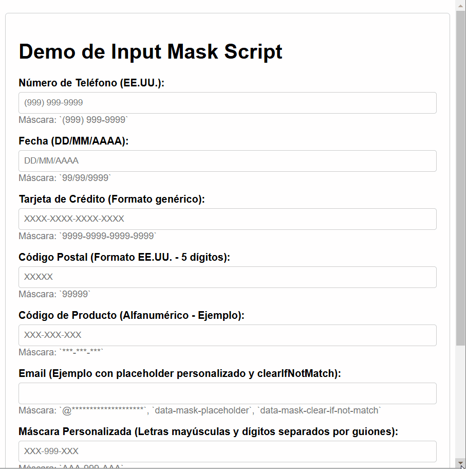

# inputmask.js



**A lightweight and versatile JavaScript script for applying input masks to form fields, enhancing user data entry experience.**

This script focuses on formatting user input in real-time as they type, guiding them to enter data in the correct format. It's perfect for fields like phone numbers, dates, credit card numbers, and more.

**Important Note:** This script **only handles input masking and formatting**. It **does not perform validation** to check if the entered data is semantically valid according to the mask (e.g., it won't check if a date is a real date, or if a credit card number is valid). You will need to implement separate validation logic if you require data validation.

## Demo

You can see a live demo by opening the `inputmask-demo.html` file in your browser. This file showcases various input fields with different masks applied, demonstrating the script's functionality.

## Installation & Usage

Integrating input masks into your website is straightforward:

1.  **Include the CSS (Optional):** Add the `inputmask-demo.css` stylesheet to your HTML document if you want to use the demo styles or as a base for your own styling. Include it in the `<head>` section:

    ```html
    <link rel="stylesheet" href="inputmask-demo.css">
    ```

    Ensure the path to `inputmask-demo.css` is correct for your project structure. This CSS file is purely for demo styling and is not required for the script to function.

2.  **Include the JavaScript:** Add the `inputmask.js` script before the closing `</body>` tag of your HTML document.

    ```html
    <script src="inputmask.js"></script>
    ```

    Make sure the path to `inputmask.js` is correct.

3.  **Apply Masks using `data-mask` Attribute:**  To apply a mask to an input field, add the `data-mask` attribute to the input element in your HTML. The value of this attribute is the mask pattern.

    ```html
    <input type="tel" id="phone" data-mask="(999) 999-9999" placeholder="(999) 999-9999">
    ```

    **Mask Definitions:**

    The script uses the following mask definition characters:

    *   `9`:  Digit (0-9)
    *   `a`:  Lowercase letter (a-z)
    *   `A`:  Uppercase letter (A-Z)
    *   `*`:  Alphanumeric character (0-9, a-z, A-Z)
    *   `#`:  Digit, space, hyphen, plus sign (for international phone numbers)
    *   `@`:  Valid email characters (alphanumeric, underscore, period, hyphen - simplified for email structure)

4.  **Optional Data Attributes for Customization:** You can further customize input mask behavior using these optional `data-mask-*` attributes:

    *   `data-mask-placeholder`:  Sets a custom placeholder text for the input. Overrides the default placeholder generated from the mask.
    *   `data-mask-placeholder-char`:  Changes the placeholder character used within the mask. Default is `_`.
    *   `data-mask-clear-if-not-match`: If present, clears the input value when the field loses focus if the input is not fully filled according to the mask.
    *   `data-mask-select-on-focus`: If present, selects all the input content when the field gains focus.

## Customization

Besides the `data-mask-*` attributes, you can customize the script by modifying the `inputmask.js` file directly:

*   **`maskDefinitions` Object:**  Extend or modify the `maskDefinitions` object to add or change the behavior of mask characters. For example, you could add a mask for currency or specific character sets.

    ```javascript
    const maskDefinitions = {
        '9': /\d/,
        'a': /[a-z]/,
        'A': /[A-Z]/,
        '*': /[a-zA-Z0-9]/,
        '#': /[\d\s\-\+]/,
        '@': /[a-zA-Z0-9_\.\-]/,
        'C': /[A-Z0-9]/  // Example: Custom mask for Uppercase alphanumeric only
    };
    ```

*   **`defaultPlaceholderChar` Constant:** Change the default placeholder character by modifying the `defaultPlaceholderChar` constant.

    ```javascript
    const defaultPlaceholderChar = '-'; // Change default to hyphen
    ```

## Getting the Unmasked Value

The `InputMask` object provides a method to retrieve the value entered by the user without the mask's literal characters and placeholders:

*   **`unmaskedValue()` method:**  To access the unmasked value of an input field that has a mask applied, you can instantiate the `InputMask` object for that input and call the `unmaskedValue()` method.  See the demo HTML for an example of how to use this to display the unmasked phone number in another field.

    ```javascript
    const phoneInput = document.getElementById('phone');
    const maskInstance = new InputMask(phoneInput, phoneInput.dataset.mask);
    const unmaskedPhoneNumber = maskInstance.unmaskedValue();
    console.log("Unmasked Phone Number:", unmaskedPhoneNumber);
    ```

## Files Included

*   **`inputmask.js`**: The JavaScript code that implements the input masking functionality.
*   **`inputmask-demo.html`**: A demo HTML file showcasing various input mask examples and usage.
*   **`inputmask-demo.css`**: (Optional) CSS stylesheet for styling the demo page.
*   **`demo.gif`**: (Optional) A GIF demonstrating the input mask in action (like the one at the top of this README).

## Author

Jaime Paez - Based on user request in prompt.

## License

This project is open-source and available under the [MIT License](LICENSE) (optional: you can add a LICENSE file and link it here). Feel free to use, modify, and distribute it according to the terms of the license.

## Contributing

Contributions are highly appreciated! If you have suggestions for improvements, bug reports, or new features, please:

1.  Fork the repository.
2.  Create a new branch for your feature or bug fix.
3.  Implement your changes and commit them.
4.  Submit a pull request.

---

**Enhance your forms with `inputmask.js` and guide your users to enter data correctly! Remember that this script focuses on masking and does not include built-in validation.**
